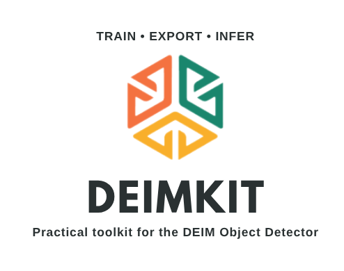
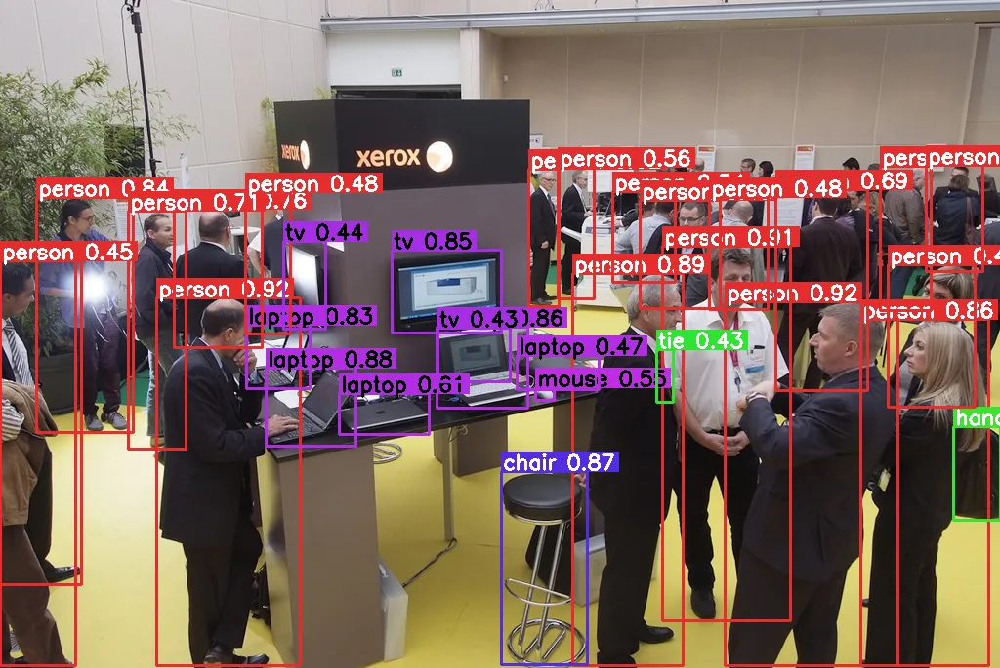
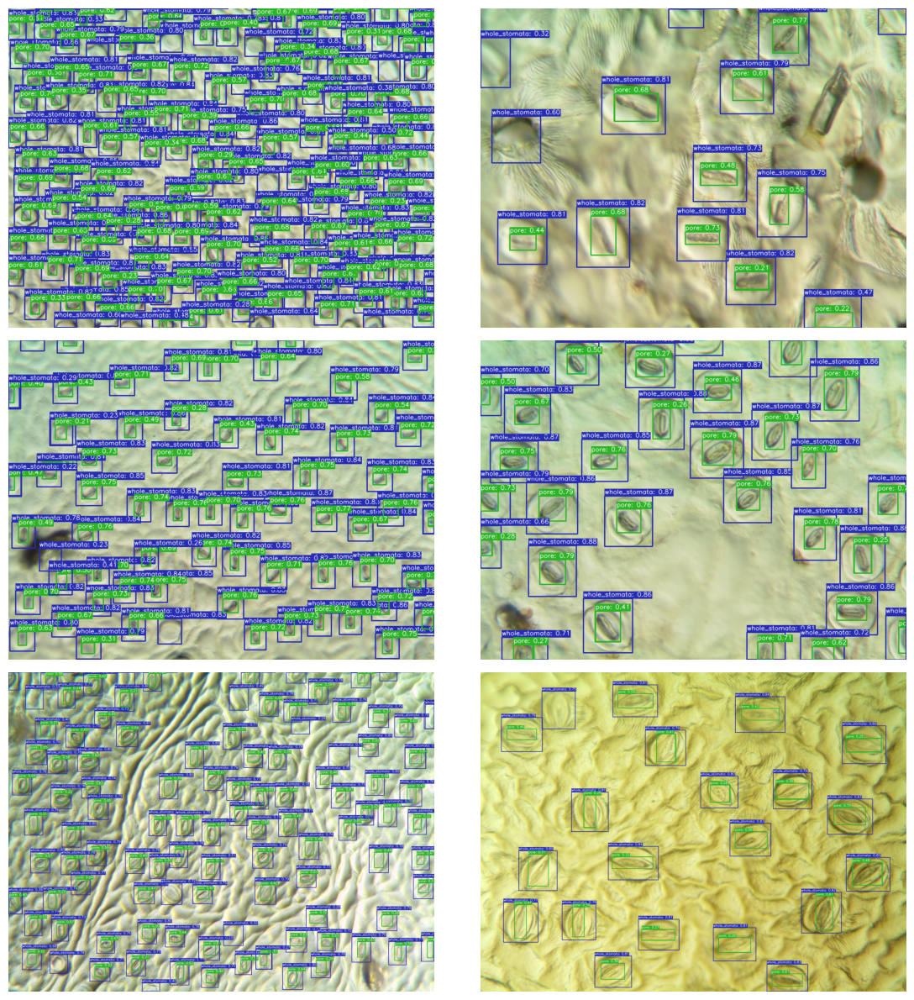
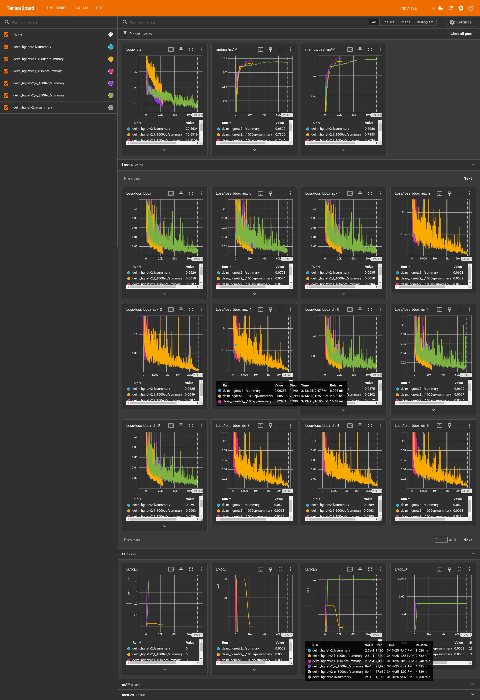
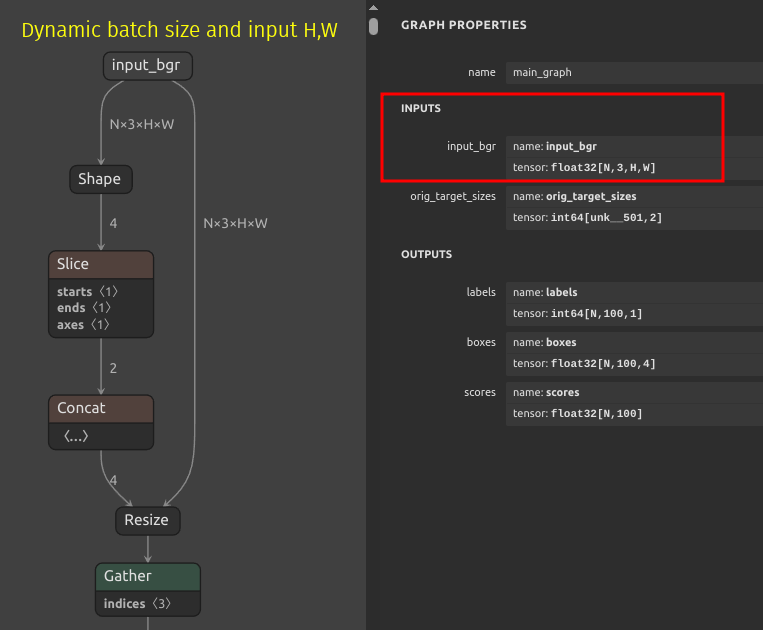
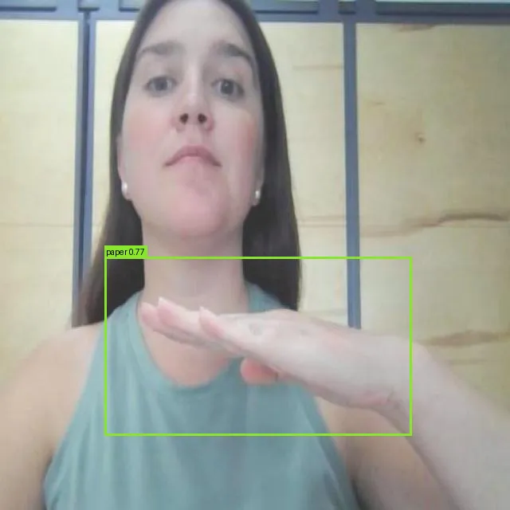

[](https://www.python.org/)
[](https://github.com/prefix-dev/pgsql-search/blob/main/LICENSE)
[](https://pixi.sh)
[](https://github.com/dnth/DEIMKit)

[colab_badge]: https://img.shields.io/badge/Open%20In-Colab-blue?style=for-the-badge&logo=google-colab
[kaggle_badge]: https://img.shields.io/badge/Open%20In-Kaggle-blue?style=for-the-badge&logo=kaggle

<div align="center">


<p>DEIMKit is a Python wrapper for <a href="https://github.com/ShihuaHuang95/DEIM">DEIM: DETR with Improved Matching for Fast Convergence</a>. Check out the original repo for more details.</p>
</div>


<!-- Add HTML Table of Contents -->
<div align="center">
    <br />
    <table>
        <tr>
            <td align="center">
                <a href="#-why-deimkit">🤔 Why DEIMKit?</a>
            </td>
            <td align="center">
                <a href="#-key-features">🌟 Key Features</a>
            </td>
            <td align="center">
                <a href="#-installation">📦 Installation</a>
            </td>
            <td align="center">
                <a href="#-usage">🚀 Usage</a>
            </td>
        </tr>
        <tr>
            <td align="center">
                <a href="#-inference">💡 Inference</a>
            </td>
            <td align="center">
                <a href="#-training">🏋️ Training</a>
            </td>
            <td align="center">
                <a href="#-export">💾 Export</a>
            </td>
             <td align="center">
                <a href="#-disclaimer">⚠️ Disclaimer</a>
            </td>
        </tr>
    </table>
</div>

<br />
<div align="center">
  <a href="https://colab.research.google.com/github/dnth/DEIMKit/blob/main/nbs/colab-quickstart.ipynb">
    
  </a>
  <a href="https://kaggle.com/kernels/welcome?src=https://github.com/dnth/DEIMKit/blob/main/nbs/colab-quickstart.ipynb">
    
  </a>
</div>
</div>

## 🤔 Why DEIMKit?
DEIMKit provides practical toolkits for using the DEIM object detector in practical applications. The original DEIM repo provides a great implementation of the DEIM object detector and DEIMKit adds some useful features for training, inference, exporting and deploying the model.

- **Pure Python Configuration** - No complicated YAML files, just clean Python code
- **Cross-Platform Simplicity** - Single command installation on Linux, macOS, and Windows
- **Intuitive API** - Load, train, predict, export in just a few lines of code

## 🌟 Key Features

*   **💡 Inference**
    *   [x] Single Image & Batch Prediction
    *   [x] Load Pretrained & Custom Models
    *   [x] Built-in Result Visualization
    *   [x] Live ONNX Inference (Webcam, Video, Image)
*   **🏋️ Training**
    *   [x] Single & Multi-GPU Training
    *   [x] Custom Dataset Support (COCO Format)
    *   [x] Flexible Configuration via Pure Python
*   **💾 Export**
    *   [x] Export Trained Models to ONNX
    *   [x] ONNX Model with Integrated Preprocessing
*   **🛠️ Utilities & Demos**
    *   [x] Extensive metric logging for debugging
    *   [x] Cross-Platform Support (Linux, macOS, Windows)
    *   [x] Pixi Environment Management Integration
    *   [x] Interactive Gradio Demo Script

## 📦 Installation

### 📥 Using pip
If you're installing using pip, install [torch](https://pytorch.org/get-started/locally/) and torchvision as a pre-requisite.

Next, install the package.
Bleeding edge version
```bash
pip install git+https://github.com/dnth/DEIM.git
```

Stable version
```bash
pip install git+https://github.com/dnth/DEIM.git@v0.2.1
```

### 🔌 Using Pixi

> [!TIP] 
> I recommend using [Pixi](https://pixi.sh) to run this package. Pixi makes it easy to install the right version of Python and the dependencies to run this package on any platform!

Install pixi if you're on Linux or MacOS. 

```bash
curl -fsSL https://pixi.sh/install.sh | bash
```

For Windows, you can use the following command.

```bash
powershell -ExecutionPolicy ByPass -c "irm -useb https://pixi.sh/install.ps1 | iex"
```

Navigate into the base directory of this repo and run 

```bash
git clone https://github.com/dnth/DEIMKit.git
cd DEIMKit
pixi run quickstart
```
This will download a toy dataset with 8 images, and train a model on it for 3 epochs and runs inference on it. It shouldn't take more than 1 minute to complete.

If this runs without any issues, you've got a working Python environment with all the dependencies installed. This also installs DEIMKit in editable mode for development. See the [pixi cheatsheet](#-pixi-cheat-sheet) below for more. 

## 🚀 Usage

List models supported by DEIMKit

```python
from deimkit import list_models

list_models()
```

```
['deim_hgnetv2_n',
 'deim_hgnetv2_s',
 'deim_hgnetv2_m',
 'deim_hgnetv2_l',
 'deim_hgnetv2_x']
```

### 💡 Inference

Load a pretrained model by the original authors

```python
from deimkit import load_model

coco_classes = ["aeroplane", ... "zebra"]
model = load_model("deim_hgnetv2_x", class_names=coco_classes)
```

Load a custom trained model

```python
model = load_model(
    "deim_hgnetv2_s", 
    checkpoint="deim_hgnetv2_s_coco_cells/best.pth",
    class_names=["cell", "platelet", "red_blood_cell", "white_blood_cell"],
    image_size=(320 , 320)
)
```

Run inference on an image

```python
result = model.predict(image_path, visualize=True)
```

Access the visualization

```python
result.visualization
```


You can also run batch inference

```python
results = model.predict_batch(image_paths, visualize=True, batch_size=8)
```

Here are some sample results I got by training on customs datasets.

Vehicles Dataset


RBC Cells Dataset


Stomata Dataset


See the [demo notebook on using pretrained models](nbs/pretrained-model-inference.ipynb) and [custom model inference](nbs/custom-model-inference.ipynb) for more details.

### 🏋️ Training

DEIMKit provides a simple interface for training your own models.

To start, configure the dataset. Specify the model, the dataset path, batch size, etc.

```python
from deimkit import Trainer, Config, configure_dataset, configure_model

conf = Config.from_model_name("deim_hgnetv2_s")

# Optional
conf = configure_model(
    config=conf, 
    num_queries=100,   # Optional, default is 300
    pretrained=True,   # Optional, default is True
    freeze_at=-1       # Optional, default is -1 (no freezing)
)

# Required
conf = configure_dataset(
    config=conf,
    image_size=(640, 640),
    train_ann_file="dataset/PCB Holes.v4i.coco/train/_annotations.coco.json",
    train_img_folder="dataset/PCB Holes.v4i.coco/train",
    val_ann_file="dataset/PCB Holes.v4i.coco/valid/_annotations.coco.json",
    val_img_folder="dataset/PCB Holes.v4i.coco/valid",
    train_batch_size=16,
    val_batch_size=16,
    num_classes=2,
    output_dir="./outputs/deim_hgnetv2_s_pcb",
)

trainer = Trainer(conf)

# Optional - Load from a previously trained checkpoint
trainer.load_checkpoint("previous_best.pth")

# All arguments are optional, if not specified, the default values for the model will be used.
trainer.fit(
    epochs=100,          # Number of training epochs
    save_best_only=True, # Save only the best model checkpoint
    lr=0.0001,           # Learning rate
    lr_gamma=0.1,        # Learning rate annealing factor
    weight_decay=0.0001, # Weight decay
)
```

To run multigpu training (4 GPU for example), place your code into a `.py` file, e.g. `train.py` and use the following command. 

```bash
CUDA_VISIBLE_DEVICES=0,1,2,3 torchrun --master_port=7778 --nproc_per_node=4 train.py
```
Modify the number of GPUs available to your system.

> [!CAUTION]
> Your dataset should be in COCO format. The class index should **start from 0**. Refer to the structure of a sample dataset exported from [Roboflow](https://universe.roboflow.com/rf-projects/pcb-holes/dataset/4). From my tests this works for DEIMKit.
>
> The `num_classes` should be the number of classes in your dataset + 1 for the background class.

Monitor training progress

```bash
tensorboard --logdir ./outputs/deim_hgnetv2_s_pcb
```
Point `--logdir` to the `output_dir` directory.

Navigate to the http://localhost:6006/ in your browser to view the training progress.



### 💾 Export
Currently, the export function is only used for exporting the model to ONNX and run it using ONNXRuntime (see [Live Inference](#-live-inference) for more details). I think one could get pretty far with this even on a low resource machine. Drop an issue if you think this should be extended to other formats.

```python
from deimkit.exporter import Exporter
from deimkit.config import Config

config = Config("config.yml")
exporter = Exporter(config)

output_path = exporter.to_onnx(
    checkpoint_path="model.pth",
    output_path="model.onnx"
)
```

> [!NOTE]
> The exported model will accept raw BGR images of any size. It will also handle the preprocessing internally. Credit to [PINTO0309](https://github.com/PINTO0309/DEIM) for the implementation.
> 
> 

> [!TIP]
> If you want to export to OpenVINO you can do so directly from the ONNX model.
> 
>
> ```python
> import onnx
> from onnx import helper
> 
> model = onnx.load("best.onnx")
>
> # Change the mode attribute of the GridSample node to bilinear as this operation is not supported in OpenVINO
> for node in model.graph.node:
>     if node.op_type == 'GridSample':
>         for i, attr in enumerate(node.attribute):
>             if attr.name == 'mode' and attr.s == b'linear':
>                 # Replace 'linear' with 'bilinear'
>                 node.attribute[i].s = b'bilinear'
>       
> # Save the modified model
> onnx.save(model, "best_prep_openvino.onnx")
> ```
> You can then use the live inference script to run inference on the OpenVINO model.

### 🖥️ Gradio App
Run a Gradio app to interact with your model. The app will accept raw BGR images of any size. It will also handle the preprocessing internally using the exported ONNX model.

```bash
python scripts/gradio_demo.py \
    --model "best.onnx" \
    --classes "classes.txt" \
    --examples "Rock Paper Scissors SXSW.v14i.coco/test"
```

https://github.com/user-attachments/assets/40743c40-36ed-4c61-80ec-a76142a4032b


> [!NOTE]
> The demo app uses onnx model and onnxruntime for inference. Additionally, I have also made it that the ONNX model to accept any input size, despite the original model was trained on 640x640 images. 
> This means you can use any image size you want. Play around with the input size slider to see what works best for your model. 
> Some objects are visible even at lower input sizes, this means you can use a lower input size to speed up inference.

### 🎥 Live Inference
> [!TIP]
> Live inference is provided as an independent script so that you can load this script into any deployment devices without having to install all the (large) dependencies in this repo. The script only requires `onnxruntime`, `cv2` and `numpy` to run.

There are two live inference scripts:

1. `live_inference.py` - Run live inference on a video, image or webcam using ONNXRuntime. This script requires a pre-exported ONNX model.
2. `live_inference_pretrained.py` - Automatically download the pretrained model, convert to ONNX, and run inference in one go.

Run live inference on a video, image or webcam using ONNXRuntime. This runs on CPU by default.
If you would like to use the CUDA backend, install the `onnxruntime-gpu` package and uninstall the `onnxruntime` package.

For running inference on a webcam, set the `--webcam` flag.

```bash
python scripts/live_inference.py 
    --model model.onnx          # Path to the ONNX model file
    --webcam                    # Use webcam as input source
    --classes classes.txt       # Path to the classes file with each name on a new row
    --inference-size 720        # Input size for the model
    --provider tensorrt         # Execution provider (cpu/cuda/tensorrt)
    --threshold 0.3             # Detection confidence threshold
```

Because we are handling the preprocessing internally in the ONNX model, the input size is not limited to the original 640x640. You can use any input size you want for inference. The model was trained on 640x640 images. Integrating the preprocessing internally in the ONNX model also lets us run inference at very high FPS as it uses more efficient onnx operators. 

The following is a model I trained on a custom dataset using the deim_hgnetv2_s model and exported to ONNX. Here are some examples of inference on a webcam at different video resolutions.

Webcam video width at 1920x1080 pixels (1080p):

https://github.com/user-attachments/assets/bd98eb1e-feff-4b53-9fa9-d4aff6a724e0

Webcam video width at 1280x720 pixels (720p):

https://github.com/user-attachments/assets/31a8644e-e0c6-4bba-9d4f-857a3d0b53e1

Webcam video width at 848x480 pixels (480p):

https://github.com/user-attachments/assets/aa267f05-5dbd-4824-973c-62f3b8f59c80

Webcam video width at 640x480 pixels (480p):

https://github.com/user-attachments/assets/3d0c04c0-645a-4d54-86c0-991930491113

Webcam video width at 320x240 pixels (240p):

https://github.com/user-attachments/assets/f4afff9c-3e6d-4965-ab86-0d4de7ce1a44


To run live inference with pretrained model on webcam, use the following command
```bash
python scripts/live_inference_pretrained.py --webcam
```
This downloads the pretrained model, converts it to ONNX, and runs inference on the webcam. All other arguments are optional but they are similar to the `live_inference.py` script.

The output is as follows


https://github.com/user-attachments/assets/5aca6044-db81-4988-937e-2447a7cbe06e


For video inference, specify the path to the video file as the input. Output video will be saved as `onnx_result.mp4` in the current directory.

```bash
python scripts/live_inference.py 
    --model model.onnx           # Path to the ONNX model file
    --video video.mp4            # Path to the input video file
    --classes classes.txt        # Path to the classes file with each name on a new row
    --inference-size 320         # Input size for the model (renamed from --video-width)
    --provider cpu               # Execution provider (cpu/cuda/tensorrt)
    --threshold 0.3              # Detection confidence threshold
```
https://github.com/user-attachments/assets/6bc1dc6a-a223-4220-954d-2dab5c75b4a8


The following is an inference using the pre-trained model `deim_hgnetv2_x` trained on COCO.

```bash
python scripts/live_inference_pretrained.py --model deim_hgnetv2_x --video video.mp4
```

https://github.com/user-attachments/assets/77070ea4-8407-4648-ade3-01cacd77b51b


For image inference, specify the path to the image file as the input.

```bash
python scripts/live_inference.py 
    --model model.onnx          # Path to the ONNX model file
    --image image.jpg           # Path to the input image file
    --classes classes.txt       # Path to the classes file with each name on a new row
    --provider cpu              # Execution provider (cpu/cuda/tensorrt)
    --threshold 0.3             # Detection confidence threshold
```


The following is a demo of image inference



> [!TIP]
> If you are using Pixi, you can run the live inference script with the following command with the same arguments as above.
>
> ```bash
> pixi run --environment cuda live-inference 
>     --onnx model.onnx           
>     --webcam                    
>     --class-names classes.txt   
>     --inference-size 320            
> ```
> Under the hood, this automatically pull in the `onnxruntime-gpu` package into the `cuda` environment and use the GPU for inference!
>
> If you want to use the CPU, replace `cuda` with `cpu` in the command above.


## 📝 Pixi Cheat Sheet
Here are some useful tasks you can run with Pixi. You must install pixi on your machine first. See the [installation](#-installation) section for more details.

> [!NOTE]
> For all commands below, you can add `-e cuda` to run in a CUDA-enabled environment instead of CPU.

### 🚀 Getting Started
```bash
# Check environment setup (CPU)
pixi run quickstart

# Check environment setup (CUDA)
pixi run -e cuda quickstart
```

### 🎥 Inference Commands
```bash
# Live inference with pretrained model (webcam)
pixi run -e cuda live-inference-pretrained --webcam

# Live inference with custom ONNX model (webcam)
pixi run -e cuda live-inference \
    --onnx model.onnx \
    --webcam \
    --provider cuda \
    --class-names classes.txt \
    --inference-size 640

# Video inference (CPU)
pixi run -e cpu live-inference \
    --onnx model.onnx \
    --input video.mp4 \
    --class-names classes.txt \
    --inference-size 320
```

### 🖥️ Gradio Demo
```bash
# Launch Gradio demo with examples
pixi run gradio-demo \
    --model "best_prep.onnx" \
    --classes "classes.txt" \
    --examples "Rock Paper Scissors SXSW.v14i.coco/test"

# Launch Gradio demo (CPU only)
pixi run -e cpu gradio-demo
```

### 🏋️ Training & Export
```bash
# Train model (CUDA)
pixi run -e cuda train-model

# Train model (CPU)
pixi run -e cpu train-model

# Export model to ONNX
pixi run export \
    --config config.yml \
    --checkpoint model.pth \
    --output model.onnx
```

> [!TIP]
> For TensorRT inference, set the `LD_LIBRARY_PATH` environment variable:
> ```bash
> export LD_LIBRARY_PATH=".pixi/envs/cuda/lib/python3.11/site-packages/tensorrt_libs:$LD_LIBRARY_PATH"
> ```

## ⚠️ Disclaimer
I'm not affiliated with the original DEIM authors. I just found the model interesting and wanted to try it out. The changes made here are of my own. Please cite and star the original repo if you find this useful.
