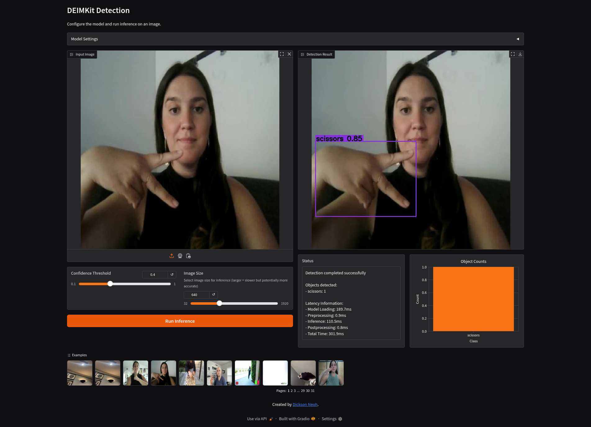
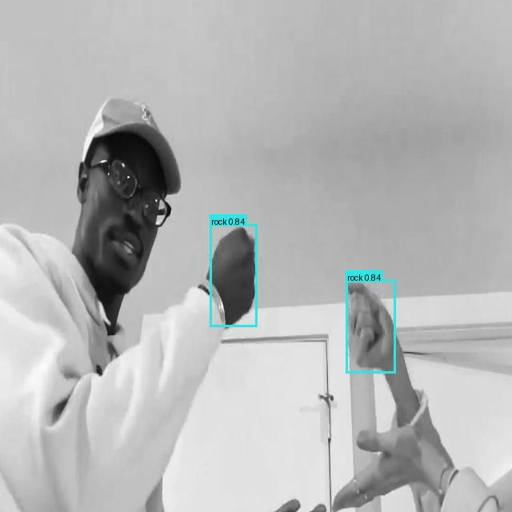

[](https://www.python.org/)
[](https://github.com/prefix-dev/pgsql-search/blob/main/LICENSE)
[](https://pixi.sh)
[](https://github.com/dnth/DEIMKit)

[colab_badge]: https://img.shields.io/badge/Open%20In-Colab-blue?style=for-the-badge&logo=google-colab
[kaggle_badge]: https://img.shields.io/badge/Open%20In-Kaggle-blue?style=for-the-badge&logo=kaggle

<div align="center">


<p>DEIMKit is a Python wrapper for <a href="https://github.com/ShihuaHuang95/DEIM">DEIM: DETR with Improved Matching for Fast Convergence</a>. Check out the original repo for more details.</p>
</div>

## Why DEIMKit?

- **Pure Python Configuration** - No complicated YAML files, just clean Python code
- **Cross-Platform Simplicity** - Single command installation on Linux, macOS, and Windows
- **Intuitive API** - Load, train, predict, export in just a few lines of code

## Supported Features

- [x] Inference
- [x] Training
- [x] Export

## Quickstart
Here's a quick example how to start using DEIMKit.

[![Open In Colab][colab_badge]](https://colab.research.google.com/github/dnth/DEIMKit/blob/main/nbs/colab-quickstart.ipynb)
[![Open In Kaggle][kaggle_badge]](https://kaggle.com/kernels/welcome?src=https://github.com/dnth/DEIMKit/blob/main/nbs/colab-quickstart.ipynb)


## Installation

### Using pip
Install [torch](https://pytorch.org/get-started/locally/) and torchvision as a pre-requisite.

## Installation

### Using pip
Install [torch](https://pytorch.org/get-started/locally/) and torchvision as a pre-requisite.

Next, install the package.
Bleeding edge version
```bash
pip install git+https://github.com/dnth/DEIM.git
```

Stable version
```bash
pip install git+https://github.com/dnth/DEIM.git@v0.1.1
```

Or install the package from the local directory in editable mode

```bash
git clone https://github.com/dnth/DEIM.git
cd DEIM
pip install -e .
```

### Using Pixi

> [!TIP] 
> I recommend using [Pixi](https://pixi.sh) to run this package. Pixi makes it easy to install the right version of Python and the dependencies to run this package on any platform!

Install pixi if you're on Linux or MacOS. 

```bash
curl -fsSL https://pixi.sh/install.sh | bash
```

For Windows, you can use the following command.

```bash
powershell -ExecutionPolicy ByPass -c "irm -useb https://pixi.sh/install.ps1 | iex"
```

Navigate into the base directory of this repo and run 

```bash
git clone https://github.com/dnth/DEIMKit.git
cd DEIMKit
pixi run quickstart
```
This will download a toy dataset with 8 images, and train a model on it for 3 epochs and runs inference on it. It shouldn't take more than 1 minute to complete.

If this runs without any issues, you've got a working Python environment with all the dependencies installed. This also installs DEIMKit in editable mode for development. See the [pixi cheatsheet](#-pixi-cheat-sheet) below for more. 

## Usage

List models supported by DEIMKit

```python
from deimkit import list_models

list_models()
```

```
['deim_hgnetv2_n',
 'deim_hgnetv2_s',
 'deim_hgnetv2_m',
 'deim_hgnetv2_l',
 'deim_hgnetv2_x']
```

### Inference

Load a pretrained model by the original authors

```python
from deimkit import load_model

coco_classes = ["aeroplane", ... "zebra"]
model = load_model("deim_hgnetv2_x", class_names=coco_classes)
```

Load a custom trained model

```python
model = load_model(
    "deim_hgnetv2_s", 
    checkpoint="deim_hgnetv2_s_coco_cells/best.pth",
    class_names=["cell", "platelet", "red_blood_cell", "white_blood_cell"],
    image_size=(320 , 320)
)
```

Run inference on an image

```python
result = model.predict(image_path, visualize=True)
```

Access the visualization

```python
result.visualization
```


You can also run batch inference

```python
results = model.predict_batch(image_paths, visualize=True, batch_size=8)
```

Here are some sample results I got by training on customs datasets.

Vehicles Dataset


RBC Cells Dataset


Stomata Dataset


See the [demo notebook on using pretrained models](nbs/pretrained-model-inference.ipynb) and [custom model inference](nbs/custom-model-inference.ipynb) for more details.

### Training

DEIMKit provides a simple interface for training your own models.

To start, configure the dataset. Specify the model, the dataset path, batch size, etc.

```python
from deimkit import Trainer, Config, configure_dataset

conf = Config.from_model_name("deim_hgnetv2_s")

conf = configure_dataset(
    config=conf,
    image_size=(640, 640),
    train_ann_file="dataset/PCB Holes.v4i.coco/train/_annotations.coco.json",
    train_img_folder="dataset/PCB Holes.v4i.coco/train",
    val_ann_file="dataset/PCB Holes.v4i.coco/valid/_annotations.coco.json",
    val_img_folder="dataset/PCB Holes.v4i.coco/valid",
    train_batch_size=16,
    val_batch_size=16,
    num_classes=2,
    output_dir="./outputs/deim_hgnetv2_s_pcb",
)

trainer = Trainer(conf)
trainer.fit(epochs=100)
```

To run multigpu training (4 GPU for example), place your code into a `.py` file, e.g. `train.py` and use the following command. 

```bash
CUDA_VISIBLE_DEVICES=0,1,2,3 torchrun --master_port=7778 --nproc_per_node=4 train.py
```
Modify the number of GPUs available to your system.

> [!CAUTION]
> Your dataset should be in COCO format. The class index should **start from 0**. Refer to the structure of a sample dataset exported from [Roboflow](https://universe.roboflow.com/rf-projects/pcb-holes/dataset/4). From my tests this works for DEIMKit.
>
> The `num_classes` should be the number of classes in your dataset + 1 for the background class.

Monitor training progress

```bash
tensorboard --logdir ./outputs/deim_hgnetv2_s_pcb
```
Point `--logdir` to the `output_dir` directory.

Navigate to the http://localhost:6006/ in your browser to view the training progress.


### Export

```python
from deimkit.exporter import Exporter
from deimkit.config import Config

config = Config("config.yml")
exporter = Exporter(config)

output_path = exporter.to_onnx(
    checkpoint_path="model.pth",
    output_path="model.onnx"
)
```

### Gradio App
Run a Gradio app to interact with your model.

```bash
python scripts/gradio_demo.py
```


### Live Inference
Run live inference on a video, image or webcam using ONNXRuntime. This runs on CPU by default.
If you would like to use the CUDA backend, you can install the `onnxruntime-gpu` package and uninstall the `onnxruntime` package.

For video inference, specify the path to the video file as the input. Output video will be saved as `onnx_result.mp4` in the current directory.

```bash
python scripts/live_inference.py 
    --onnx model.onnx           # Path to the ONNX model file
    --input video.mp4           # Path to the input video file
    --class-names classes.txt   # Path to the classes file with each name on a new row
    --input-size 320            # Input size for the model
```

The following is a demo of video inference after training for about 50 epochs on the vehicles dataset with image size 320x320.

https://github.com/user-attachments/assets/5066768f-c97e-4999-af81-ffd29d88f529


You can also run live inference on a webcam by setting the `webcam` flag.

```bash
python scripts/live_inference.py 
    --onnx model.onnx           # Path to the ONNX model file
    --webcam                    # Use webcam as input source
    --class-names classes.txt   # Path to the classes file. Each class name should be on a new line.
    --input-size 320            # Input size for the model
```
The following is a demo of webcam inference after training on the rock paper scissors dataset 640x640 resolution image.

https://github.com/user-attachments/assets/6e5dbb15-4e3a-45a3-997e-157bb9370146


For image inference, specify the path to the image file as the input.
```bash
python scripts/live_inference.py 
    --onnx model.onnx           # Path to the ONNX model file
    --input image.jpg           # Path to the input image file
    --class-names classes.txt   # Path to the classes file. Each class name should be on a new line.
    --input-size 320            # Input size for the model
```
The following is a demo of image inference



> [!TIP]
> If you are using Pixi, you can run the live inference script with the following command with the same arguments as above.
>
> ```bash
> pixi run --environment cuda live-inference 
>     --onnx model.onnx           
>     --webcam                    
>     --class-names classes.txt   
>     --input-size 320            
> ```
> Under the hood, this automatically pull in the `onnxruntime-gpu` package into the `cuda` environment and use the GPU for inference!
>
> If you want to use the CPU, replace `cuda` with `cpu` in the command above.


## Pixi Cheat Sheet
Here are some useful tasks you can run with Pixi.

Run a quickstart
```bash
pixi run quickstart
```

Smoke test the package
```bash
pixi run -e cpu quickstart
```
```bash
pixi run -e cuda quickstart
```

Train a model
```bash
pixi run -e cuda train-model
```

```bash
pixi run -e cpu train-model
```

Run live inference
```bash
pixi run -e cuda live-inference --onnx model.onnx --webcam --provider cuda --class-names classes.txt --input-size 640
```

> [!TIP]
> If you want to use TensorRT for inference, you may need to set the `LD_LIBRARY_PATH` environment variable to include the TensorRT libraries.
>
> For example
> ```bash
> export LD_LIBRARY_PATH="/home/dnth/Desktop/DEIMKit/.pixi/envs/cuda/lib/python3.11/site-packages/tensorrt_libs:$LD_LIBRARY_PATH"
> ```

```bash
pixi run -e cpu live-inference --onnx model.onnx --input video.mp4 --class-names classes.txt --input-size 320
```

Launch Gradio app
```bash
pixi run -e cuda gradio-demo
```

```bash
pixi run -e cpu gradio-demo
```

Export model to ONNX
```bash
pixi run export --config config.yml --checkpoint model.pth --output model.onnx
```


## Disclaimer
I'm not affiliated with the original DEIM authors. I just found the model interesting and wanted to try it out. The changes made here are of my own. Please cite and star the original repo if you find this useful.
